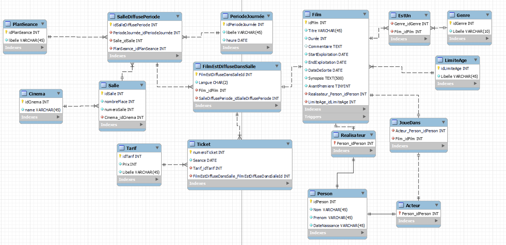

# Tables des matières

1. [Script SQL](#script)
2. [MCD](#mcd)
3. [Question](#question)
4. [Remarques](#remarques)
   
## Script
### Cloner le projet
Clonez le projet avec la commande : 

```git clone https://github.com/Herissflamm/SQLDM.git``` 

Puis déplacez-vous dans le répertoire avec la commande : 

```cd SQLDM```

### Création de la base
Pour la création de la base, il faut utiliser la commande : 

```mysql -u root -p < Schema.sql``` 

### Ajout des données
Enfin, pour l'ajout des données en base, vous allez utiliser la commande suivante : 

```mysql -u root -p < Data.sql```

### Utilisation des queries
Pour exécuter les queries, chaque réponses est précédé par "-- Question x --" où x correspond au numéro de la question
Veuillez prendre en compte que les réponses qui demandent des inserts ont déjà été exécutés lors de l'ajout des données. Toutes nouvelles exécution pour entraîner des doublons.
De plus, pour les procédures et fonctions, elles ont été aussi exécutées lors de la création de la base. Un requête pour les exécutés est présentes après leur requête de création dans le fichier queries.sql

## MCD

## Question
Pour la question 14 : 
Je pense qu'ajouter une procédure qui avant l'insert de donnée, vérifie si les créneaux ne se chevauchent pas. Si elles se chevauchent bien, il faut annuler l'insert de données.
## Remarques
J'ai eu des complications sur les order by quand c'est des valeurs qui ne sont pas dans la table initiale du from. Par exemple question 1, pour afficher Matin en première valeur. 
J'ai aussi eu des soucis de conception qui m'ont demandé de faire des allers retour dans les schéma de base pour faire des petites modifications que j'avais pas prévu lors de la conception. Par exemple, j'ai pas compris direct qu'un film pouvait avoir plusieurs genre/type.
